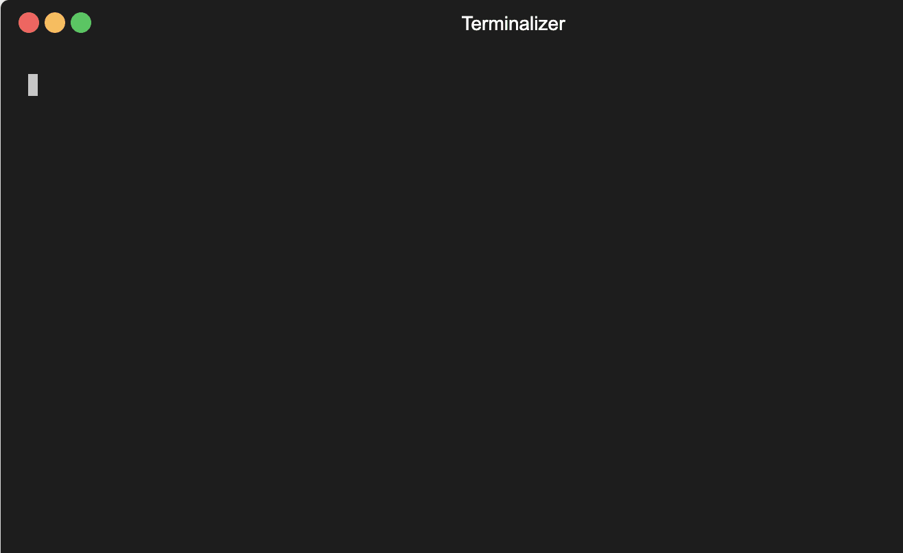

# Terraform Variables

### Statement and Types

```
variable "name" {
  type = number | string | bool | map(type) | list(type) | object
  default = value
}

``` 

#### Understanding variables reference using `terraform console` 

